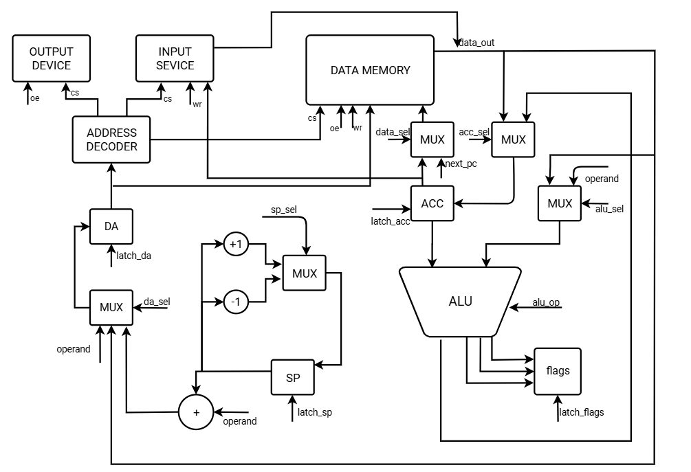
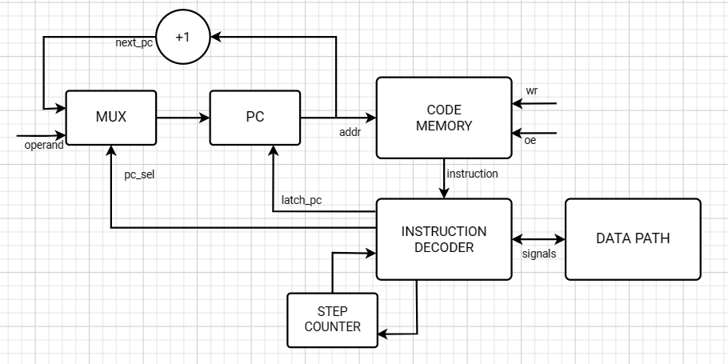

# Авшистер Ольга Аркадьевна P3213

`lisp | acc | harv | hw | instr | binary | stream | mem | cstr | prob1`

Без усложнения

## Язык программирования

Описание синтаксиса языка в форме БНФ:

```ebnf
digit := '0' | '1' | '2' | ... | '9'
letter := 'a' | 'b' | 'c' | ... 'z'

number := '-'? digit*
string := '"' <any symbol except a double quote> '"'
name := letter*
operation := '+' | '-' | '*' | '/' | '%' | '=' | '!=' | '<' | '>' | '<=' | '>='

expression := 
    number | 
    string |
    name | 
    operation |
    '(' expression* ')'

program := expression*
```

Программы пишутся в виде s-выражений, как в Lisp/Scheme.

Пример программы:

```lisp
(defun prob (count result)
       (if (< count 1000)
           (if (= (% count 3) 0)
               (prob (+ count 1) (+ result count))
               (if (= (% count 5) 0)
                   (prob (+ count 1) (+ result count))
                   (prob (+ count 1) result)))
           result))

(printnumber (prob 1 0))
```

Специальные формы, существующие в языке:

* `do` позволяет выполнить несколько выражений:

        (do expr1 expr2 expr3)

* `if` позволяет сделать ветвление:

        (if cond pos-branch neg-branch)

* `define` объявляет переменную:

        (define name value)

* `defun` объявляет функцию:

        (defun name (arg1 arg2 arg3) body)
    
Язык поддерживает всего два типа данных:

1. Целые числа 
2. Строки 

Числа -- целые 32-битные: от -2147483648 до 2147483647.

Результат всех математических операций будет "обрезан" до младших 32-бит без завершения программы.

Операция деления `/` при делении на ноль завершает программу с ошибкой.

Результат операций сравнения возвращается как `1` или `0`.

Отдельные символы строки имеют тип целого числа.  

Поддерживаются строковые литералы произвольной длины. В конце строки ставится символ-ноль `\0`, в соответствие с вариантом. 

Область видимости переменных -- локальная в рамках функций и частей `if`.

Все функции должны обладать уникальными именами, не совпадающими с именами переменных в данной области видимости.

Функции имеют доступ только к своим локальным переменным и параметрам. Глобальные переменные поддерживаются, однако доступ к ним имеет только код, не находящийся ни в каких функциях.

Стратегия вычислений -- строгая, аппликативный порядок. То есть все вычисления происходят в том порядке, в каком они даны в программе. Параметры функций вычисляются до вызова функции, слева направо.

Поддерживается рекурсия.

Язык предоставляет следующие встроенные функции:

* `getchar` получение i-ого символа из строки:

         (getchar "hello" 0)

* `setchar` меняет i-ый символ в строке:

         (setchar str i sym)

* `readchar` читает один символ из потока ввода
* `printchar` печатает один символ в поток вывода
* `readstring` читает строку в предвыделенный буфер

        (readstring (makestring 200))

* `printnumber` выводит число на экран

         (printnumber 123)

* `printstring` выводит строку на экран

         (printstring "hello")


## Организация памяти

Система построена по гарвардской архитектуре, то есть память разделена на:

1. память инструкций
2. память данных

Обе памяти работают в линейном, плоском адресном пространстве.

### Регистры

Система обладает аккумуляторной архитектурой. Поэтому большинство операций происходит над аккумулятором. Остальные регистры устанавливаются процессором.

```text
       Registers
+------------------------------+
| acc                          |
| flags                        |
| sp                           |
| da                           |
| pc                           |
+------------------------------+
```

Все регистры -- 32-битные. За исключением регистра `flags`, который хранит результаты сравнения (3 бита).

Никакие переменные не отображаются на регистры, так как по сути нам доступен всего один регистр -- аккумулятор.

### Память инструкций

Размер машинного слова -- 48 бит.

Одна инструкция занимает одно машинное слово: 2 байта используется для кода операции и 4 байта используется для операнда.

Единственный вариант адресации -- прямая адресация. Адрес для памяти данных может быть использован только напрямую в инструкциях перехода и в инструкции `CALL`. Например,

    JMP 100
    
Первым в памяти инструкций располагается главный код программы, далее по порядку располагаются тела всех функций.
   
```
       Instruction memory
+------------------------------+
| 00  : program body           |
|    ...                       |
|  i  : function body          |
|  j  : function body          |
|  k  : function body          |
|    ...                       |
+------------------------------+
```

Память инструкций доступна только для чтения, а именно для выполнения программы из неё и переходов по этой программе.

### Память данных

Размер машинного слова -- 32 бит.

Одно число занимает одно машинное слово.

Один символ также занимает одно машинное слово.

Символы строки хранятся как отдельные машинные слова, включая специальный символ-ноль `\0`.

Варианты адресации:

* прямая адресация, например,

        LD [1000]

* базовая адресация со смещением, например,

        LD [SP + 100]
    
* косвенная адресация 2-ого порядка (разымёнывание указателя):
    
        LD [[SP + 100]]

Структура памяти:

```text
          Data memory
+--------------------------------------+
| 00  : input port reserved address    |
| 01  : output port reserved address   |
| 02  : string literal 1 char 1        |
| 03  : string literal 1 char 2        |
|    ...                               |
|  i  : string literal 2 char 1        |
| i+1 : string literal 2 char 2        |
|    ...                               |
|  j  : pre-allocated string 1 char 1  |
| j+1 : pre-allocated string 1 char 2  |
|    ...                               |
|  k  : pre-allocated string 2 char 1  |
| k+1 : pre-allocated string 2 char 2  |
|    ...                               |
| n-k : stack variable k               |
|    ...                               |
| n-3 : stack variable 3               |
| n-2 : stack variable 2               |
| n-1 : stack variable 1               |
+--------------------------------------+
```

### Зарезервированные ячейки

Первые два адреса (`00` и `01`) зарезервированы для портов ввода/вывода. (Конкретные адреса настраиваются в коде симулятора).

### Числа

Все числовые константы любого размера (в рамках 32 бит) встраиваются непосредственно в саму инструкцию. Например,

    000101000000 LD 1
    
Здесь константа `1` является частью описания инструкции `01000000`.

Другими словами, все числовые литералы используют непосредственную адресацию.

### Строки

Все строковые литералы сохраняются в памяти в порядке их обнаружения в исходном коде программы. Транслятор избегает расположения в памяти дублирующихся строк.

Строки сохраняются посимвольно. Один символ - одно машинное слово.

Значением строкового литерала считается адрес первого символа строки данного литерала. Например, при передаче строки в виде параметра функции на стек копируется адрес строки, а не сама строка.

Поэтому, так как адрес строки - это число, то строки используют непосредсвенную адресацию.

Программист может выделить ничем не заполненную строку фиксированного размера, например, для будущего ввода данных от пользователя. 

    (makestring 100)
    
Такие строки располагаются после обычных строк в порядке их обнаружения в коде программы.

### Стек

Симулятор выделяет стек фиксированного размера и расширяет им память данных. 

На стеке сохраняются все переменные и параметры, а также адреса возврата функций. 

Строковые переменные хранят адрес первого символа строки.

Так как глобальные переменные трактуются транслятором как специальный вид локальных переменных, существующих всё время работы программы, то они также существуют на стеке.


## Система команд

### Особенности процессора

Машинное слово -- 32 бит, знаковое. Исключение составляет память команд, размер машинного слова которой -- 48 бит.

Так как процессор обладает аккумуляторной архитектурой, большинство инструкций работают с аккумулятором.

Все математические операции устанавливают биты в регистре `FLAGS` в зависимости от значения аккумулятора (меньше нуля, ноль, больше нуля).

Доступ к памяти осуществляется по адресу, хранимому в регистре `DA` (data address). 

Типы операндов инструкций:

1. `IMMEDIATE`

    Непосредственная константа

2. `ADDRESS`

    Адрес в памяти данных или в памяти инструкций в зависимости от инструкции

3. `STACK_OFFSET`

    Адрес в памяти данных, вычисляемый на базе стекового регистра `SP` с константным смещением

4. `STACK_POINTER`

    Косвенная адресация относительно стекового регистра `STACK_POINTER`. (По сути, это указатель, хранящийся как переменная на стеке).

Процессор имеет аппаратную поддержку стека:

* регистр `SP` указывает на вершину стека
* инструкция `PUSH` кладёт значение аккумулятора на стек
* инструкцию `POP` удаляет вершину стека.

    `POP` не меняет аккумулятор. Это сделано для удобства программирования, по сути `POP` используется для очистки стека, а не для взятия значений с него.

Другие особенности:

* инструкция `CMP` не реализована, потому что вместо неё можно использовать `SUB`
* инструкции `AND`, `OR`, `XOR`, и `NOT` не реализованы, потому что их можно заменить математическими манипуляциями

Поток управления:

* инкремент `PC` после каждой инструкции;
* условные (`JL`, `JLE`, `JE`, `JG`, `JGE`, `JNE`)) и безусловный (`JMP`) переходы.
* вызов и возврат из функции (`CALL`, `RET`)

### Набор инструкций

| Код  | Мнемоника | Тип операнда  | Действие                              |
|------|-----------|---------------|---------------------------------------|
| 0001 | LD        | IMMEDIATE     | operand -> ACC                        |
| 0002 | LD        | ADDRESS       | DMEM[operand] -> ACC                  |
| 0003 | LD        | STACK_OFFSET  | DMEM[SP + operand] -> ACC             |
| 0004 | LD        | STACK_POINTER | DMEM[DMEM[SP + operand]] -> ACC       |
| 0102 | ST        | ADDRESS       | ACC -> DMEM[operand]                  |
| 0103 | ST        | STACK_OFFSET  | ACC -> DMEM[SP + operand]             |
| 0104 | ST        | STACK_POINTER | ACC -> DMEM[DMEM[SP + operand]]       |
| 0201 | ADD       | IMMEDIATE     | ACC + operand -> ACC<br>ACC < 0, ACC = 0, ACC > 0 -> FLAGS    |
| 0202 | ADD       | ADDRESS       | ACC + DMEM[operand] -> ACC<br>ACC < 0, ACC = 0, ACC > 0 -> FLAGS    |
| 0203 | ADD       | STACK_OFFSET  | ACC + DMEM[SP + operand] -> ACC<br>ACC < 0, ACC = 0, ACC > 0 -> FLAGS    |
| 0204 | ADD       | STACK_POINTER | ACC + DMEM[DMEM[SP + operand]] -> ACC<br>ACC < 0, ACC = 0, ACC > 0 -> FLAGS    |
| 0301 | SUB       | IMMEDIATE     | ACC - operand -> ACC<br>ACC < 0, ACC = 0, ACC > 0 -> FLAGS    |
| 0302 | SUB       | ADDRESS       | ACC - DMEM[operand] -> ACC<br>ACC < 0, ACC = 0, ACC > 0 -> FLAGS    |
| 0303 | SUB       | STACK_OFFSET  | ACC - DMEM[SP + operand] -> ACC<br>ACC < 0, ACC = 0, ACC > 0 -> FLAGS    |
| 0304 | SUB       | STACK_POINTER | ACC - DMEM[DMEM[SP + operand]] -> ACC<br>ACC < 0, ACC = 0, ACC > 0 -> FLAGS    |
| 0401 | MUL       | IMMEDIATE     | ACC * operand -> ACC<br>ACC < 0, ACC = 0, ACC > 0 -> FLAGS    |
| 0402 | MUL       | ADDRESS       | ACC * DMEM[operand] -> ACC<br>ACC < 0, ACC = 0, ACC > 0 -> FLAGS    |
| 0403 | MUL       | STACK_OFFSET  | ACC * DMEM[SP + operand] -> ACC<br>ACC < 0, ACC = 0, ACC > 0 -> FLAGS    |
| 0404 | MUL       | STACK_POINTER | ACC * DMEM[DMEM[SP + operand]] -> ACC<br>ACC < 0, ACC = 0, ACC > 0 -> FLAGS    |
| 0501 | DIV       | IMMEDIATE     | ACC / operand -> ACC<br>ACC < 0, ACC = 0, ACC > 0 -> FLAGS    |
| 0502 | DIV       | ADDRESS       | ACC / DMEM[operand] -> ACC<br>ACC < 0, ACC = 0, ACC > 0 -> FLAGS    |
| 0503 | DIV       | STACK_OFFSET  | ACC / DMEM[SP + operand] -> ACC<br>ACC < 0, ACC = 0, ACC > 0 -> FLAGS    |
| 0504 | DIV       | STACK_POINTER | ACC / DMEM[DMEM[SP + operand]] -> ACC<br>ACC < 0, ACC = 0, ACC > 0 -> FLAGS    |    
| 0601 | REM       | IMMEDIATE     | ACC % operand -> ACC<br>ACC < 0, ACC = 0, ACC > 0 -> FLAGS    |
| 0602 | REM       | ADDRESS       | ACC % DMEM[operand] -> ACC<br>ACC < 0, ACC = 0, ACC > 0 -> FLAGS    |
| 0603 | REM       | STACK_OFFSET  | ACC % DMEM[SP + operand] -> ACC<br>ACC < 0, ACC = 0, ACC > 0 -> FLAGS    |
| 0604 | REM       | STACK_POINTER | ACC % DMEM[DMEM[SP + operand]] -> ACC<br>ACC < 0, ACC = 0, ACC > 0 -> FLAGS    |     
| 0702 | JMP       | ADDRESS       | operand -> PC                         |
| 0802 | JE        | ADDRESS       | if ZF = 1 then operand -> PC          |
| 0902 | JG        | ADDRESS       | if PF = 1 then operand -> PC          |
| 0A02 | JGE       | ADDRESS       | if ZF = 1 or PF = 1 then operand -> PC|
| 0B02 | JL        | ADDRESS       | if NF = 1 then operand -> PC          |
| 0C02 | JLE       | ADDRESS       | if ZF = 1 or NF = 1 then operand -> PC|
| 0D02 | JNE       | ADDRESS       | if ZF = 0 then operand -> PC          |
| 0E00 | PUSH      | NONE          | SP - 1 -> SP; ACC -> DMEM[SP]         |
| 0F00 | POP       | NONE          | SP + 1 -> SP                          |
| 1002 | CALL      | ADDRESS       | SP - 1 -> SP;   PC + 1 -> DMEM[SP]; operand -> PC      |
| 1100 | RET       | NONE          | DMEM[SP]| -> PC; SP + 1 -> SP         |
| 1200 | HLT       | NONE          | (останов машины)                      |

В описании инструкций для упрощения опущены манипуляции регистром `DA`. `DMEM` - память данных.

### Кодирование инструкций

Каждая инструкция кодируется с помощью одного машинного слова размером 48 бит:

| Биты  | Описание          |
|-------|-------------------|
| 0-7   | Код операции      |
| 8-15  | Тип операнда      |
| 16-47 | Значение операнда |

Тип операнда -- цифра от 0 до 4:

0. `NONE` (нет операнда)
1. `IMMEDIATE`
2. `ADDRESS`
3. `STACK_OFFSET`
4. `STACK_POINTER`

Операндом может быть числовая константа, адрес или смещение относительно значения регистра `SP`.


## Транслятор

Интерфейс командной строки: 

```
usage: translator [-h] source_name binary_name memory_name [debug_name]

Lisp-like language translator

positional arguments:
  source_name  input file with program source code
  binary_name  output file for binary code
  memory_name  output file for static memory content
  debug_name   output file for debug information

options:
  -h, --help   show this help message and exit
```

Реализовано в модуле: [translator](translator.py).

Транслятор преобразует текст программы в древовидную структуру. Затем производит последовательные преобразования этой структуры. В итоге генерируется плоский список инструкций, которые затем кодируются в машинный код.

Этапы трансляции (функция `translate`):

1. Предобработка
    1. Подключение исходного кода [stdlib.lsp](стандартной библиотеки `stdlib.lsp`)
    1. Разбиение строки на символы (с запоминанием номеров строк каждого символа)
    1. Объединение символов в строковые литералы
    1. Объединение символов в числовые литералы
    1. Объединение символов в имена (идентификаторы)
    1. Объединение символов для составных операторов (`>=`, `<=`, `!=`)
    1. Удаление пробелов
1. Преобразование плоского списка токенов в древовидную структуру в соответствии со скобками в исходном коде программы
1. Весь исходный код оборачивается в функцию 
1. `\n` в строковых литералах превращается в символ перевода строки
1. Поиск всех строковых литералов с дедубликацией и расчётом адресов
1. Генерация части статической памяти для строковых литералов
1. Замена строковых литералов на их адреса
1. Замена числовых токенов на реальные числа
1. Обработка форм `(makestring size)`
1. Разбиение составных выражений на простые выражения 
1. Замена обращений к функциям на специальные объекты `FuncRef`
1. Разбиение всей программы на отдельные функции 
1. Обработка каждой функции:
    1. Замена обращений аргументов функций на объекты `ArgRef`
    1. Замена обращений к переменным на объекты `VarRef`
    1. Подсчёт использования стека `if`-ами
    1. Замена ссылок на аргументы и переменные на ссылки на стек
    1. Поиск хвостовых рекурсивных вызовов функций и расчёт их стека
1. Генерация инструкций для каждой функции
1. Расчёт адресов функций
1. Превращение относительных адресов прыжков в абсолютные
1. Соединение всех инструкций в единую программу
1. Генерация машинного кода инструкций

Транслятор выполняет проверку корректности программы: 

* проверка чисел на 32-битный диапазон 
* проверка имён функций и переменных 
* проверка общей структуры программы
* проверка количества операндов при вызовах операций
* проверка количества параметров при вызовах функций

Правила генерации машинного кода:

* математические выражения генерируют соответствующие инструкции (так как все сложные выражения разбиты на простейшие):

        ; (+ 1 2)
   
        LD 1
        ADD 2
        
        ; (* x y)
        
        LD [SP + ...]
        MUL [SP + ...]
        
* операции сравнения порождают инструкцию `SUB` и записывают `1` или `0` в аккумулятор:

        ; (= num 0)

            LD [SP + 1]        ; num
            SUB 0              ; сравнение через вычитание
            JE l1              ; зависит от операции (JG/JL/JNE..)
            LD 0               ; false
            JMP l2             ;    
        l1:
            LD 1               ; true
        l2:
        
* введение переменной порождает инструкцию `PUSH`:

        ; (define x 42)
        
        LD 42
        PUSH
        
* вызовы функции порождают инструкции `PUSH`, `CALL` и `POP`:

        ; (printstring "hello")

        LD 100      ; адрес строки "hello"
        PUSH        ; передача параметра
        CALL 82     ; 82 - адрес функции
        POP         ; очистка параметра после вызова

* хвостовой рекурсивный вызов порождает `ST`, `POP`, `JMP`:

        ; (f 5)

        LD 5           ; параметр
        ST [SP + ...]  ; обновление параметра
        POP            ; очистка локальных переменных
        JMP 100        ; 100 - адрес функции
        
* ветвление `if` порожадет `SUB` и инструкции переходов:

        ; (if ... ... ...)

            SUB 0              ; сравнение условия с true
            JE l2              ; прыжок в "else"
        l1:
            (код главной ветви)
            JMP l3
        l2: 
            (код альтернативной ветви)
        l3:
    
* для встроенных функций генерируется следующее:

        ; (readchar)
        LD [0]      
        
        ; (printchar)
        ST [1]             
        
        ; (setchar s i ch)
        LD [SP + ...]       ; загружаем i
        ADD [SP + ...]      ; добавляем s
        PUSH                ; сохраняем на стеке
        LD [SP + ...]       ; загружаем ch
        ST [[SP + 0]]       ; изменение s[i]
        
        ; (getchar s i)
        LD [SP + ...]       ; загружаем i
        ADD [SP + ...]      ; добавляем s
        PUSH                ; сохраняем на стеке
        LD [[SP + 0]]       ; взятие s[i]
    

## Модель процессора

Интерфейс командной строки: 

```
usage: simulator [-h] binary_name memory_name [input_name] [debug_name]
                 [--limit [LIMIT]] 
                 [--logging-level [LOGGING_LEVEL]]
                 [--debug-level [DEBUG_LEVEL]]

Accumulator architecture CPU simulator

positional arguments:
  binary_name           input file with binary code
  memory_name           input file with static memory content
  input_name            input file for simulated input
  debug_name            input file with debug information

options:
  -h, --help            show this help message and exit
  --limit [LIMIT]       maximum number of instructions to execute
  --logging-level [LOGGING_LEVEL]
                        logging level: error, warning, info (default) or debug
  --debug-level [DEBUG_LEVEL]
                        debug level: 1 - input/output, 2 - instructions, 3 - full information (defualt)
```

Реализовано в модуле: [simulator](simulator.py).

Data Path и Control Unit реализованы как одноимённые классы. `DataPath` принимает сигналы от `ControlUnit` в виде объекта `Signals`, хранящего описание сигналов.

### DataPath



Схема `DataPath` принимает следующие сигналы от `ControlUnit`:

* `latch_sp` - записать выбраннное значение в регистр `SP`:
    * `SP + 1`
    * `SP - 1`
* `latch_da` - записать выбраннное значение в регистр `DA`:
    * операнд инструкции `operand`
    * выход памяти `data_out`
    * адрес на стеке со смещением `SP + operand`   
* `alu_op` - код математической операции для выполнения на АЛУ между аккумулятором и выбранным значением:
    * операнд инструкции `operand`
    * выход памяти `data_out`
* `latch_acc` - записать выбраннное значение в регистр `ACC`:
    * результат работы АЛУ
    * выход памяти `data_out`
* `latch_flags` - сохранить флаги `NF`, `ZF`, `PF`
* `oe` - прочитать значение из памяти или порта ввода
* `wr` - записать аккумулятор в порт вывода или записать выбранное значение в память:
    * значение аккумулятора `ACC`
    * адрес следующей инструкции `next_pc`, равный `PC + 1`

Флаги:

* `NF` - признак отрицательности результата АЛУ
* `ZF` - признак того, что результат АЛУ равен нулю
* `PF` - признак положительности результата АЛУ

`ADDRESS DECODER` - декодер адреса, в зависимости от адреса `DA` активирует соответвующее устройство с помощью входов `cs`:
    * `INPUT DEVICE` - порт ввода
    * `OUTPUT DEVICE` - порт вывода
    * `DATA MEMORY` - однопортовая память данных
    
`operand` - это операнд текущей инструкции (числовое значение, адрес, смещение)

Обработка сигналов выполняется в методе `handle_signals`.


### ControlUnit



Сигналы:

* `latch_pc` - записать выбранное значение в регистр `PC`:
    * адрес следующей инструкции `next_pc`, равный `PC + 1`
    * операнд инструкции `operand`

Особенности работы модели:

* Цикл симуляции осуществляется в функции `simulate`.
* Шаг моделирования соответствует одной инструкции с выводом состояния в журнал.
* Для журнала состояний процессора используется стандартный модуль `logging`.
* Количество инструкций для моделирования может быть опционально лимитировано через параметр `limit`.
* Остановка моделирования осуществляется при:
    * выполнении инструкции `HLT` (в этом случае порождается исключение `StopIteration`)
    * превышении лимита количества выполняемых инструкций `limit`;
    * исчерпании данных в порте ввода (в этом случае порождается исключение `EOFError`)
    * ошибка деления на ноль 
    * некорректный машинный код
    * выход за пределы памяти
    * запись в порт ввода
    * чтение из порта вывода  

* `CODE MEMORY` - однопортовая память инструкций, всегда находящаяся в режиме чтения
* `INSTRUCTION DECODER` - декодирует и выполняет одну инструкцию:
    * декодирует бинарный код инструкции в:
        * код операции
        * тип операнда
        * значение операнда
    * выполняет инструкцию, посылая сигналы в `DataPath` 
        * выполнение происходит потактово (на схеме для этого добавлен счётчик `STEP COUNTER`)
    * реализован на уровне модели Python

## Тестирование

Тестирование выполняется при помощи golden test-ов.

* Golden test-ы реализованы для следующих программ: 
    - [golden/hello.yml](golden/hello.yml) - напечатать hello world
    - [golden/cat.yml](golden/cat.yml) - печатать данные, поданные на вход симулятору через файл ввода (размер ввода потенциально бесконечен)
    - [golden/hello_user_name.yml](golden/hello_user_name.yml) - запросить у пользователя его имя, считать его, вывести на экран приветствие
    - [golden/prob1.yml](golden/prob1.yml) - задача №1 из Project Euler
    - [golden/example.yml](golden/example.yml) - дополнительно разработанная программа для демонстрации возможностей системы
* Скрипт выполнения интеграционных тестов: [integration_test.py](integration_test.py)

Запустить тесты: `poetry run pytest . -v`

Обновить конфигурацию golden tests: `poetry run pytest . -v --update-goldens`

CI настроен при помощи Github Actions:

```yaml
name: Python CI

on:
  push:
    branches:
      - main
  pull_request:
    branches:
      - main

jobs:
  test:
    runs-on: ubuntu-latest

    steps:
      - name: Checkout code
        uses: actions/checkout@v4

      - name: Set up Python
        uses: actions/setup-python@v4
        with:
          python-version: 3.11

      - name: Install dependencies
        run: |
          python -m pip install --upgrade pip
          pip install poetry
          poetry install

      - name: Run tests and collect coverage
        run: |
          poetry run coverage run -m pytest .
          poetry run coverage report -m
        env:
          CI: true

  lint:
    runs-on: ubuntu-latest

    steps:
      - name: Checkout code
        uses: actions/checkout@v4

      - name: Set up Python
        uses: actions/setup-python@v4
        with:
          python-version: 3.11

      - name: Install dependencies
        run: |
          python -m pip install --upgrade pip
          pip install poetry
          poetry install

      - name: Check code formatting with Ruff
        run: poetry run ruff format --check .

      - name: Run Ruff linters
        run: poetry run ruff check .
        
      - name: Run MyPy type checker
        run: poetry run mypy .
```

где:

- `poetry` -- управления зависимостями для языка программирования Python.
- `coverage` -- формирование отчёта об уровне покрытия исходного кода.
- `pytest` -- утилита для запуска тестов.
- `ruff` -- утилита для форматирования и проверки стиля кодирования.
- `mypy` -- утилита для проверки типов в Python-коде

Пример использования и журнал работы процессора на примере `cat`:

```console
$ cat cat.lsp
(defun f () (do (printchar (readchar)) (f)))
(f)
$ cat cat.txt
Alice
$ python translator.py cat.lsp cat.bin cat.dat cat.dbg
LoC: 2
Instructions: 223
$ cat cat.dbg
CODE:
0000: 100202000000 CALL 2             ; (f)
0001: 120000000000 HLT                ;
0002: 000200000000 LD [0]             ; (defun f () (do (printchar (readchar)) (f)))
0003: 0e0000000000 PUSH               ; (defun f () (do (printchar (readchar)) (f)))
0004: 000300000000 LD [SP + 0]        ; (defun f () (do (printchar (readchar)) (f)))
0005: 010201000000 ST [1]             ; (defun f () (do (printchar (readchar)) (f)))
0006: 0f0000000000 POP                ; (defun f () (do (printchar (readchar)) (f)))
0007: 070202000000 JMP 2              ; (defun f () (do (printchar (readchar)) (f)))
0008: 0f0000000000 POP                ;
0009: 110000000000 RET                ;
0010: 000200000000 LD [0]             ;     (define c (readchar))
0011: 0e0000000000 PUSH               ;     (define c (readchar))
0012: 000303000000 LD [SP + 3]        ;     (setchar s i c)
0013: 020302000000 ADD [SP + 2]       ;     (setchar s i c)
0014: 0e0000000000 PUSH               ;     (setchar s i c)
0015: 000301000000 LD [SP + 1]        ;     (setchar s i c)
0016: 010400000000 ST [[SP + 0]]      ;     (setchar s i c)
0017: 000301000000 LD [SP + 1]        ;     (if (= c 0)
0018: 030100000000 SUB 0              ;     (if (= c 0)
0019: 080216000000 JE 22              ;     (if (= c 0)
0020: 000100000000 LD 0               ;     (if (= c 0)
0021: 070217000000 JMP 23             ;     (if (= c 0)
0022: 000101000000 LD 1               ;     (if (= c 0)
0023: 030100000000 SUB 0              ;     (if (= c 0)
0024: 08021b000000 JE 27              ;     (if (= c 0)
0025: 000304000000 LD [SP + 4]        ;         s
0026: 070227000000 JMP 39             ;     (if (= c 0)
0027: 000303000000 LD [SP + 3]        ;         (doreadstring s (+ i 1)))))
0028: 020101000000 ADD 1              ;         (doreadstring s (+ i 1)))))
0029: 0e0000000000 PUSH               ;         (doreadstring s (+ i 1)))))
0030: 000305000000 LD [SP + 5]        ;         (doreadstring s (+ i 1)))))
0031: 010305000000 ST [SP + 5]        ;         (doreadstring s (+ i 1)))))
0032: 000300000000 LD [SP + 0]        ;         (doreadstring s (+ i 1)))))
0033: 010304000000 ST [SP + 4]        ;         (doreadstring s (+ i 1)))))
0034: 0f0000000000 POP                ;         (doreadstring s (+ i 1)))))
0035: 0f0000000000 POP                ;         (doreadstring s (+ i 1)))))
0036: 0f0000000000 POP                ;         (doreadstring s (+ i 1)))))
0037: 07020a000000 JMP 10             ;         (doreadstring s (+ i 1)))))
0038: 0f0000000000 POP                ;     (if (= c 0)
0039: 0f0000000000 POP                ;
0040: 0f0000000000 POP                ;
0041: 110000000000 RET                ;
0042: 000301000000 LD [SP + 1]        ;     (doreadstring s 0))
0043: 0e0000000000 PUSH               ;     (doreadstring s 0))
0044: 000100000000 LD 0               ;     (doreadstring s 0))
0045: 0e0000000000 PUSH               ;     (doreadstring s 0))
0046: 10020a000000 CALL 10            ;     (doreadstring s 0))
0047: 0f0000000000 POP                ;     (doreadstring s 0))
0048: 0f0000000000 POP                ;     (doreadstring s 0))
0049: 110000000000 RET                ;
0050: 000302000000 LD [SP + 2]        ;     (define c (getchar s i))
0051: 020301000000 ADD [SP + 1]       ;     (define c (getchar s i))
0052: 0e0000000000 PUSH               ;     (define c (getchar s i))
0053: 000400000000 LD [[SP + 0]]      ;     (define c (getchar s i))
0054: 0e0000000000 PUSH               ;     (define c (getchar s i))
0055: 000300000000 LD [SP + 0]        ;     (if (= c 0)
0056: 030100000000 SUB 0              ;     (if (= c 0)
0057: 08023c000000 JE 60              ;     (if (= c 0)
0058: 000100000000 LD 0               ;     (if (= c 0)
0059: 07023d000000 JMP 61             ;     (if (= c 0)
0060: 000101000000 LD 1               ;     (if (= c 0)
0061: 030100000000 SUB 0              ;     (if (= c 0)
0062: 080241000000 JE 65              ;     (if (= c 0)
0063: 000303000000 LD [SP + 3]        ;         i
0064: 07024f000000 JMP 79             ;     (if (= c 0)
0065: 000300000000 LD [SP + 0]        ;         (do (printchar c)
0066: 010201000000 ST [1]             ;         (do (printchar c)
0067: 000303000000 LD [SP + 3]        ;             (doprintstring s (+ i 1))))))
0068: 020101000000 ADD 1              ;             (doprintstring s (+ i 1))))))
0069: 0e0000000000 PUSH               ;             (doprintstring s (+ i 1))))))
0070: 000305000000 LD [SP + 5]        ;             (doprintstring s (+ i 1))))))
0071: 010305000000 ST [SP + 5]        ;             (doprintstring s (+ i 1))))))
0072: 000300000000 LD [SP + 0]        ;             (doprintstring s (+ i 1))))))
0073: 010304000000 ST [SP + 4]        ;             (doprintstring s (+ i 1))))))
0074: 0f0000000000 POP                ;             (doprintstring s (+ i 1))))))
0075: 0f0000000000 POP                ;             (doprintstring s (+ i 1))))))
0076: 0f0000000000 POP                ;             (doprintstring s (+ i 1))))))
0077: 070232000000 JMP 50             ;             (doprintstring s (+ i 1))))))
0078: 0f0000000000 POP                ;     (if (= c 0)
0079: 0f0000000000 POP                ;
0080: 0f0000000000 POP                ;
0081: 110000000000 RET                ;
0082: 000301000000 LD [SP + 1]        ; (defun printstring (s) (doprintstring s 0))
0083: 0e0000000000 PUSH               ; (defun printstring (s) (doprintstring s 0))
0084: 000100000000 LD 0               ; (defun printstring (s) (doprintstring s 0))
0085: 0e0000000000 PUSH               ; (defun printstring (s) (doprintstring s 0))
0086: 100232000000 CALL 50            ; (defun printstring (s) (doprintstring s 0))
0087: 0f0000000000 POP                ; (defun printstring (s) (doprintstring s 0))
0088: 0f0000000000 POP                ; (defun printstring (s) (doprintstring s 0))
0089: 110000000000 RET                ;
0090: 000303000000 LD [SP + 3]        ;     (if (!= num 0)
0091: 030100000000 SUB 0              ;     (if (!= num 0)
0092: 0d025f000000 JNE 95             ;     (if (!= num 0)
0093: 000100000000 LD 0               ;     (if (!= num 0)
0094: 070260000000 JMP 96             ;     (if (!= num 0)
0095: 000101000000 LD 1               ;     (if (!= num 0)
0096: 030100000000 SUB 0              ;     (if (!= num 0)
0097: 080285000000 JE 133             ;     (if (!= num 0)
0098: 000303000000 LD [SP + 3]        ;         (do (define digit (% num 10))
0099: 06010a000000 REM 10             ;         (do (define digit (% num 10))
0100: 0e0000000000 PUSH               ;         (do (define digit (% num 10))
0101: 000303000000 LD [SP + 3]        ;             (setchar buf i (+ digit 48))
0102: 020302000000 ADD [SP + 2]       ;             (setchar buf i (+ digit 48))
0103: 0e0000000000 PUSH               ;             (setchar buf i (+ digit 48))
0104: 000301000000 LD [SP + 1]        ;             (setchar buf i (+ digit 48))
0105: 020130000000 ADD 48             ;             (setchar buf i (+ digit 48))
0106: 0e0000000000 PUSH               ;             (setchar buf i (+ digit 48))
0107: 000300000000 LD [SP + 0]        ;             (setchar buf i (+ digit 48))
0108: 010401000000 ST [[SP + 1]]      ;             (setchar buf i (+ digit 48))
0109: 000306000000 LD [SP + 6]        ;             (writedigits (/ num 10) buf (- i 1)))
0110: 05010a000000 DIV 10             ;             (writedigits (/ num 10) buf (- i 1)))
0111: 0e0000000000 PUSH               ;             (writedigits (/ num 10) buf (- i 1)))
0112: 000305000000 LD [SP + 5]        ;             (writedigits (/ num 10) buf (- i 1)))
0113: 030101000000 SUB 1              ;             (writedigits (/ num 10) buf (- i 1)))
0114: 0e0000000000 PUSH               ;             (writedigits (/ num 10) buf (- i 1)))
0115: 000301000000 LD [SP + 1]        ;             (writedigits (/ num 10) buf (- i 1)))
0116: 010308000000 ST [SP + 8]        ;             (writedigits (/ num 10) buf (- i 1)))
0117: 000307000000 LD [SP + 7]        ;             (writedigits (/ num 10) buf (- i 1)))
0118: 010307000000 ST [SP + 7]        ;             (writedigits (/ num 10) buf (- i 1)))
0119: 000300000000 LD [SP + 0]        ;             (writedigits (/ num 10) buf (- i 1)))
0120: 010306000000 ST [SP + 6]        ;             (writedigits (/ num 10) buf (- i 1)))
0121: 0f0000000000 POP                ;             (writedigits (/ num 10) buf (- i 1)))
0122: 0f0000000000 POP                ;             (writedigits (/ num 10) buf (- i 1)))
0123: 0f0000000000 POP                ;             (writedigits (/ num 10) buf (- i 1)))
0124: 0f0000000000 POP                ;             (writedigits (/ num 10) buf (- i 1)))
0125: 0f0000000000 POP                ;             (writedigits (/ num 10) buf (- i 1)))
0126: 07025a000000 JMP 90             ;             (writedigits (/ num 10) buf (- i 1)))
0127: 0f0000000000 POP                ;     (if (!= num 0)
0128: 0f0000000000 POP                ;     (if (!= num 0)
0129: 0f0000000000 POP                ;     (if (!= num 0)
0130: 0f0000000000 POP                ;     (if (!= num 0)
0131: 0f0000000000 POP                ;     (if (!= num 0)
0132: 070287000000 JMP 135            ;     (if (!= num 0)
0133: 000301000000 LD [SP + 1]        ;         (+ i 1)))
0134: 020101000000 ADD 1              ;         (+ i 1)))
0135: 110000000000 RET                ;
0136: 000301000000 LD [SP + 1]        ;     (if (= num 0)
0137: 030100000000 SUB 0              ;     (if (= num 0)
0138: 08028d000000 JE 141             ;     (if (= num 0)
0139: 000100000000 LD 0               ;     (if (= num 0)
0140: 07028e000000 JMP 142            ;     (if (= num 0)
0141: 000101000000 LD 1               ;     (if (= num 0)
0142: 030100000000 SUB 0              ;     (if (= num 0)
0143: 080295000000 JE 149             ;     (if (= num 0)
0144: 000102000000 LD 2               ;         (printstring "0")
0145: 0e0000000000 PUSH               ;         (printstring "0")
0146: 100252000000 CALL 82            ;         (printstring "0")
0147: 0f0000000000 POP                ;         (printstring "0")
0148: 0702de000000 JMP 222            ;     (if (= num 0)
0149: 000112000000 LD 18              ;            (define buf (makestring 10))
0150: 0e0000000000 PUSH               ;            (define buf (makestring 10))
0151: 000302000000 LD [SP + 2]        ;            (if (> num 0)
0152: 030100000000 SUB 0              ;            (if (> num 0)
0153: 09029c000000 JG 156             ;            (if (> num 0)
0154: 000100000000 LD 0               ;            (if (> num 0)
0155: 07029d000000 JMP 157            ;            (if (> num 0)
0156: 000101000000 LD 1               ;            (if (> num 0)
0157: 030100000000 SUB 0              ;            (if (> num 0)
0158: 0802b4000000 JE 180             ;            (if (> num 0)
0159: 000302000000 LD [SP + 2]        ;                    (define i (writedigits num buf 9))
0160: 0e0000000000 PUSH               ;                    (define i (writedigits num buf 9))
0161: 000301000000 LD [SP + 1]        ;                    (define i (writedigits num buf 9))
0162: 0e0000000000 PUSH               ;                    (define i (writedigits num buf 9))
0163: 000109000000 LD 9               ;                    (define i (writedigits num buf 9))
0164: 0e0000000000 PUSH               ;                    (define i (writedigits num buf 9))
0165: 10025a000000 CALL 90            ;                    (define i (writedigits num buf 9))
0166: 0f0000000000 POP                ;                    (define i (writedigits num buf 9))
0167: 0f0000000000 POP                ;                    (define i (writedigits num buf 9))
0168: 0f0000000000 POP                ;                    (define i (writedigits num buf 9))
0169: 0e0000000000 PUSH               ;                    (define i (writedigits num buf 9))
0170: 000301000000 LD [SP + 1]        ;                    (printstring (+ buf i)))
0171: 020300000000 ADD [SP + 0]       ;                    (printstring (+ buf i)))
0172: 0e0000000000 PUSH               ;                    (printstring (+ buf i)))
0173: 000300000000 LD [SP + 0]        ;                    (printstring (+ buf i)))
0174: 0e0000000000 PUSH               ;                    (printstring (+ buf i)))
0175: 100252000000 CALL 82            ;                    (printstring (+ buf i)))
0176: 0f0000000000 POP                ;                    (printstring (+ buf i)))
0177: 0f0000000000 POP                ;            (if (> num 0)
0178: 0f0000000000 POP                ;            (if (> num 0)
0179: 0702dd000000 JMP 221            ;            (if (> num 0)
0180: 000302000000 LD [SP + 2]        ;                (if (= num -2147483648)
0181: 030100000080 SUB -2147483648    ;                (if (= num -2147483648)
0182: 0802b9000000 JE 185             ;                (if (= num -2147483648)
0183: 000100000000 LD 0               ;                (if (= num -2147483648)
0184: 0702ba000000 JMP 186            ;                (if (= num -2147483648)
0185: 000101000000 LD 1               ;                (if (= num -2147483648)
0186: 030100000000 SUB 0              ;                (if (= num -2147483648)
0187: 0802c1000000 JE 193             ;                (if (= num -2147483648)
0188: 000104000000 LD 4               ;                    (printstring "-2147483648")
0189: 0e0000000000 PUSH               ;                    (printstring "-2147483648")
0190: 100252000000 CALL 82            ;                    (printstring "-2147483648")
0191: 0f0000000000 POP                ;                    (printstring "-2147483648")
0192: 0702dd000000 JMP 221            ;                (if (= num -2147483648)
0193: 000110000000 LD 16              ;                        (printstring "-")
0194: 0e0000000000 PUSH               ;                        (printstring "-")
0195: 100252000000 CALL 82            ;                        (printstring "-")
0196: 0f0000000000 POP                ;                        (printstring "-")
0197: 000302000000 LD [SP + 2]        ;                        (define i (writedigits (* num -1) buf 9))
0198: 0401ffffffff MUL -1             ;                        (define i (writedigits (* num -1) buf 9))
0199: 0e0000000000 PUSH               ;                        (define i (writedigits (* num -1) buf 9))
0200: 000300000000 LD [SP + 0]        ;                        (define i (writedigits (* num -1) buf 9))
0201: 0e0000000000 PUSH               ;                        (define i (writedigits (* num -1) buf 9))
0202: 000302000000 LD [SP + 2]        ;                        (define i (writedigits (* num -1) buf 9))
0203: 0e0000000000 PUSH               ;                        (define i (writedigits (* num -1) buf 9))
0204: 000109000000 LD 9               ;                        (define i (writedigits (* num -1) buf 9))
0205: 0e0000000000 PUSH               ;                        (define i (writedigits (* num -1) buf 9))
0206: 10025a000000 CALL 90            ;                        (define i (writedigits (* num -1) buf 9))
0207: 0f0000000000 POP                ;                        (define i (writedigits (* num -1) buf 9))
0208: 0f0000000000 POP                ;                        (define i (writedigits (* num -1) buf 9))
0209: 0f0000000000 POP                ;                        (define i (writedigits (* num -1) buf 9))
0210: 0e0000000000 PUSH               ;                        (define i (writedigits (* num -1) buf 9))
0211: 000302000000 LD [SP + 2]        ;                        (printstring (+ buf i))))))))
0212: 020300000000 ADD [SP + 0]       ;                        (printstring (+ buf i))))))))
0213: 0e0000000000 PUSH               ;                        (printstring (+ buf i))))))))
0214: 000300000000 LD [SP + 0]        ;                        (printstring (+ buf i))))))))
0215: 0e0000000000 PUSH               ;                        (printstring (+ buf i))))))))
0216: 100252000000 CALL 82            ;                        (printstring (+ buf i))))))))
0217: 0f0000000000 POP                ;                        (printstring (+ buf i))))))))
0218: 0f0000000000 POP                ;                (if (= num -2147483648)
0219: 0f0000000000 POP                ;                (if (= num -2147483648)
0220: 0f0000000000 POP                ;                (if (= num -2147483648)
0221: 0f0000000000 POP                ;     (if (= num 0)
0222: 110000000000 RET                ;
DATA:
0000: 00000000
0001: 00000000
0002: 00000030
0003: 00000000
0004: 0000002d
0005: 00000032
0006: 00000031
0007: 00000034
0008: 00000037
0009: 00000034
0010: 00000038
0011: 00000033
0012: 00000036
0013: 00000034
0014: 00000038
0015: 00000000
0016: 0000002d
0017: 00000000
0018: 00000000
0019: 00000000
0020: 00000000
0021: 00000000
0022: 00000000
0023: 00000000
0024: 00000000
0025: 00000000
0026: 00000000
0027: 00000000
0028: 00000000
$ python simulator.py cat.bin cat.dat cat.txt cat.dbg --logging-level=debug
DEBUG:root:input_stream=['A', 'l', 'i', 'c', 'e', '\x00'] output_stream=[]
DEBUG:root:0000: 100202000000 CALL 2           ; (f)
DEBUG:root:0002: 000200000000 LD [0]           ; (defun f () (do (printchar (readchar)) (f)))
DEBUG:root:input_stream=['l', 'i', 'c', 'e', '\x00'] output_stream=[]
DEBUG:root:0003: 0e0000000000 PUSH             ; (defun f () (do (printchar (readchar)) (f)))
DEBUG:root:0004: 000300000000 LD [SP + 0]      ; (defun f () (do (printchar (readchar)) (f)))
DEBUG:root:0005: 010201000000 ST [1]           ; (defun f () (do (printchar (readchar)) (f)))
DEBUG:root:input_stream=['l', 'i', 'c', 'e', '\x00'] output_stream=['A']
DEBUG:root:0006: 0f0000000000 POP              ; (defun f () (do (printchar (readchar)) (f)))
DEBUG:root:0007: 070202000000 JMP 2            ; (defun f () (do (printchar (readchar)) (f)))
DEBUG:root:0002: 000200000000 LD [0]           ; (defun f () (do (printchar (readchar)) (f)))
DEBUG:root:input_stream=['i', 'c', 'e', '\x00'] output_stream=['A']
DEBUG:root:0003: 0e0000000000 PUSH             ; (defun f () (do (printchar (readchar)) (f)))
DEBUG:root:0004: 000300000000 LD [SP + 0]      ; (defun f () (do (printchar (readchar)) (f)))
DEBUG:root:0005: 010201000000 ST [1]           ; (defun f () (do (printchar (readchar)) (f)))
DEBUG:root:input_stream=['i', 'c', 'e', '\x00'] output_stream=['A', 'l']
DEBUG:root:0006: 0f0000000000 POP              ; (defun f () (do (printchar (readchar)) (f)))
DEBUG:root:0007: 070202000000 JMP 2            ; (defun f () (do (printchar (readchar)) (f)))
DEBUG:root:0002: 000200000000 LD [0]           ; (defun f () (do (printchar (readchar)) (f)))
DEBUG:root:input_stream=['c', 'e', '\x00'] output_stream=['A', 'l']
DEBUG:root:0003: 0e0000000000 PUSH             ; (defun f () (do (printchar (readchar)) (f)))
DEBUG:root:0004: 000300000000 LD [SP + 0]      ; (defun f () (do (printchar (readchar)) (f)))
DEBUG:root:0005: 010201000000 ST [1]           ; (defun f () (do (printchar (readchar)) (f)))
DEBUG:root:input_stream=['c', 'e', '\x00'] output_stream=['A', 'l', 'i']
DEBUG:root:0006: 0f0000000000 POP              ; (defun f () (do (printchar (readchar)) (f)))
DEBUG:root:0007: 070202000000 JMP 2            ; (defun f () (do (printchar (readchar)) (f)))
DEBUG:root:0002: 000200000000 LD [0]           ; (defun f () (do (printchar (readchar)) (f)))
DEBUG:root:input_stream=['e', '\x00'] output_stream=['A', 'l', 'i']
DEBUG:root:0003: 0e0000000000 PUSH             ; (defun f () (do (printchar (readchar)) (f)))
DEBUG:root:0004: 000300000000 LD [SP + 0]      ; (defun f () (do (printchar (readchar)) (f)))
DEBUG:root:0005: 010201000000 ST [1]           ; (defun f () (do (printchar (readchar)) (f)))
DEBUG:root:input_stream=['e', '\x00'] output_stream=['A', 'l', 'i', 'c']
DEBUG:root:0006: 0f0000000000 POP              ; (defun f () (do (printchar (readchar)) (f)))
DEBUG:root:0007: 070202000000 JMP 2            ; (defun f () (do (printchar (readchar)) (f)))
DEBUG:root:0002: 000200000000 LD [0]           ; (defun f () (do (printchar (readchar)) (f)))
DEBUG:root:input_stream=['\x00'] output_stream=['A', 'l', 'i', 'c']
DEBUG:root:0003: 0e0000000000 PUSH             ; (defun f () (do (printchar (readchar)) (f)))
DEBUG:root:0004: 000300000000 LD [SP + 0]      ; (defun f () (do (printchar (readchar)) (f)))
DEBUG:root:0005: 010201000000 ST [1]           ; (defun f () (do (printchar (readchar)) (f)))
DEBUG:root:input_stream=['\x00'] output_stream=['A', 'l', 'i', 'c', 'e']
DEBUG:root:0006: 0f0000000000 POP              ; (defun f () (do (printchar (readchar)) (f)))
DEBUG:root:0007: 070202000000 JMP 2            ; (defun f () (do (printchar (readchar)) (f)))
DEBUG:root:0002: 000200000000 LD [0]           ; (defun f () (do (printchar (readchar)) (f)))
DEBUG:root:input_stream=[] output_stream=['A', 'l', 'i', 'c', 'e']
DEBUG:root:0003: 0e0000000000 PUSH             ; (defun f () (do (printchar (readchar)) (f)))
DEBUG:root:0004: 000300000000 LD [SP + 0]      ; (defun f () (do (printchar (readchar)) (f)))
DEBUG:root:0005: 010201000000 ST [1]           ; (defun f () (do (printchar (readchar)) (f)))
DEBUG:root:input_stream=[] output_stream=['A', 'l', 'i', 'c', 'e', '\x00']
DEBUG:root:0006: 0f0000000000 POP              ; (defun f () (do (printchar (readchar)) (f)))
DEBUG:root:0007: 070202000000 JMP 2            ; (defun f () (do (printchar (readchar)) (f)))
DEBUG:root:0002: 000200000000 LD [0]           ; (defun f () (do (printchar (readchar)) (f)))
WARNING:root:end of input stream reached
37 instructions executed
Final output stream: ['A', 'l', 'i', 'c', 'e', '\x00']
```

Пример проверки исходного кода:

```console
$ poetry run pytest . -v
========================================= test session starts =========================================
platform linux -- Python 3.11.2, pytest-7.4.4, pluggy-1.4.0 -- /home/olga/.cache/pypoetry/virtualenvs/lisp-9Zo3gskc-py3.11/bin/python
cachedir: .pytest_cache
rootdir: /home/olga/project
configfile: pyproject.toml
plugins: golden-0.2.2
collected 5 items

integration_test.py::test_translator_and_machine[golden/hello_user_name.yml] PASSED             [ 20%]
integration_test.py::test_translator_and_machine[golden/prob1.yml] PASSED                       [ 40%]
integration_test.py::test_translator_and_machine[golden/hello.yml] PASSED                       [ 60%]
integration_test.py::test_translator_and_machine[golden/example.yml] PASSED                     [ 80%]
integration_test.py::test_translator_and_machine[golden/cat.yml] PASSED                         [100%]

========================================== 5 passed in 3.33s ==========================================
$ poetry run ruff check .
$ poetry run ruff format .
4 files left unchanged
$ poetry run mypy .
Success: no issues found in 4 source files
```


## Статистика

```text
| Авшистер Ольга Аркадьевна | cat | 2 | 1338 | 223 | 37 | - | lisp | acc | harv | hw | instr | binary | stream | mem | cstr | prob1 |
| Авшистер Ольга Аркадьевна | hello | 1 | 1308 | 218 | 304 | - | lisp | acc | harv | hw | instr | binary | stream | mem | cstr | prob1 |
| Авшистер Ольга Аркадьевна | hello_user_name | 5 | 1416 | 236 | 1070 | - | lisp | acc | harv | hw | instr | binary | stream | mem | cstr | prob1 |
| Авшистер Ольга Аркадьевна | prob1 | 9 | 1824 | 304 | 35153 | - | lisp | acc | harv | hw | instr | binary | stream | mem | cstr | prob1 |
| Авшистер Ольга Аркадьевна | example | 45 | 2442 | 407 | 15500 | - | lisp | acc | harv | hw | instr | binary | stream | mem | cstr | prob1 |
```

